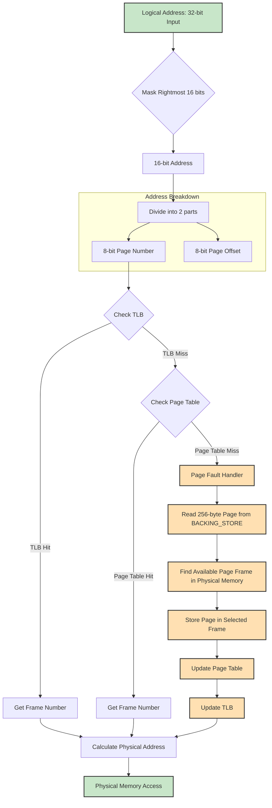

# Virtual Memory Manager

## Overview

This project implements a virtual memory management system that translates logical addresses to physical addresses for a virtual address space of size 2^16 = 65,536 bytes. The program reads logical addresses from a file, translates them using a TLB and page table, and outputs the value of the byte stored at the translated physical address.

The main learning goal is to understand the steps involved in translating logical to physical addresses, including:
- Resolving page faults using demand paging
- Managing a Translation Lookaside Buffer (TLB)
- Implementing page-replacement algorithms

## Specifications

The system has the following specifications:
- 2^8 (256) entries in the page table
- Page size of 2^8 (256) bytes
- 16 entries in the TLB
- Frame size of 2^8 (256) bytes
- 256 frames
- Physical memory of 65,536 bytes (256 frames × 256-byte frame size)

The program handles 16-bit logical addresses (masked from 32-bit integers), divided into:
- An 8-bit page number (high-order bits)
- An 8-bit page offset (low-order bits)

## Implementation Details



### Address Translation Process

1. Extract the page number from the logical address
2. Check the TLB for the page number
    - If TLB hit: Get the frame number from the TLB
    - If TLB miss: Check the page table
        - If page table hit: Get the frame number from the page table
        - If page table miss: Handle page fault

### Page Fault Handling

When a page fault occurs, the program:
1. Reads the required 256-byte page from the backing store (`BACKING_STORE.bin`)
2. Stores it in an available page frame in physical memory
3. Updates the page table and TLB with the new mapping
4. Continues with the address translation

### Data Structures

- **TLB**: Implemented as a deque of page-frame pairs with FIFO replacement policy
- **Page Table**: Array mapping page numbers to frame numbers
- **Physical Memory**: 2D array representing frames and their contents
- **Backing Store**: Binary file accessed randomly to load pages on demand

## Usage

### Compilation

```shell
g++ -std=c++20 -o backingstore backing_store_filler.cpp && ./backingstore
g++ -std=c++20 -o main main.cpp
```

### Running the Program
```shell
./main address.txt
```

The program reads logical addresses from addresses.txt, translates them to physical addresses, and outputs:

The logical address being translated
The corresponding physical address
The signed byte value stored at the physical address
Example Output

```text
0x0000 -> 0x0000 -> 0
0x0001 -> 0x0001 -> 0
...
0x3e95 -> 0xb895 -> -78
0xf79d -> 0xd89d -> -42
...
Page Fault Rate = 24.9%
TLB Hit Rate = 4.6%
```

### Statistics
After processing all addresses, the program reports:

-  Page-fault rate: The percentage of address references that resulted in page faults
-  TLB hit rate: The percentage of address references that were resolved in the TLB


### Advanced Implementation: Limited Physical Memory
The project can be extended to simulate a more realistic scenario where physical memory is smaller than the virtual address space:

-  Reduce physical memory to 128 page frames (instead of 256)
-  Implement a page-replacement policy (FIFO or LRU) to handle page faults when there is no free memory 
-  Track free page frames and manage memory allocation

### Files
-  main.cpp: Main program implementation
-  addresses.txt: Input file containing logical addresses to translate
-  BACKING_STORE.bin: Binary file representing the backing store
correct.txt: Reference output for validation

### Implementation Classes
-  TLB: Manages the Translation Lookaside Buffer
-  PageTable: Handles page-to-frame mappings
-  PhysicalMemory: Simulates physical memory organization
-  BackingStore: Interfaces with the backing store file